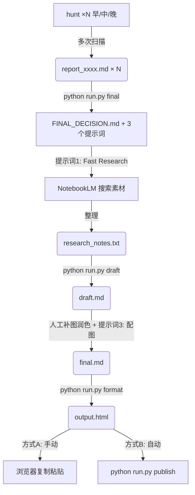

# 🚀 王往AI 公众号工作流

一套完整的 AI 驱动的微信公众号内容生产工作流，从选题到发布**全流程自动化**。

## ✨ 功能特性

| 模块 | 功能 | 技术栈 |
|------|------|--------|
| 🎯 **选题雷达** | 全网扫描热点，AI动态生成搜索词，智能推荐选题 | DeepSeek + Tavily API |
| ✍️ **写作智能体** | 读取研究笔记，生成符合人设的初稿 | DeepSeek Reasoner |
| 📋 **TODO提取器** | 列出草稿中需要补充的截图和内容 | Python Regex |
| 🎨 **排版智能体** | Markdown 转 HTML，壹伴风格，一键复制 | Pygments + Premailer |
| 📤 **发布智能体** | 自动上传图片，一键创建草稿 | wechatpy + 微信API |

## 📁 项目结构

```text
wx_articles/
├── README.md                # 项目说明
├── requirements.txt         # Python 依赖
├── config.py.example       # 配置模板
├── config.py               # 你的配置（已被 gitignore）
├── run.py                  # 统一入口脚本
├── agents/                 # 智能体模块
│   ├── __init__.py
│   ├── trend_hunter.py     # 🎯 选题雷达
│   ├── drafter.py          # ✍️ 写作智能体
│   ├── todo_extractor.py   # 📋 TODO 提取器
│   ├── formatter.py        # 🎨 排版智能体
│   └── publisher.py        # 📤 发布智能体
└── data/archive/           # 按日期 + 阶段归档
        └── 2025-12-04/
            ├── 1_topics/       # 选题报告
            │   ├── report_xxxx.md     # 单次扫描报告
            │   └── FINAL_DECISION.md  # 综合决策 + 3个提示词
            ├── 2_research/     # 研究素材 ← 在这里编辑
            │   └── notes.txt          # 从 NotebookLM 整理的笔记
            ├── 3_drafts/       # AI 初稿
            │   ├── draft.md           # AI 生成的初稿
            │   └── todo_list.txt      # 待补充清单
            ├── 4_publish/      # 待发布文件
            │   ├── final.md           # 你润色后的定稿
            │   └── output.html        # 格式化后的 HTML
            └── 5_assets/       # 配图素材
                └── (截图、信息图等)   # publish 时会上传到微信
```

### 📂 文件夹用途详解

| 文件夹 | 用途 | 操作 |
|--------|------|------|
| `1_topics/` | 选题报告 | `hunt` 生成，`final` 综合 |
| `2_research/` | 研究素材 | **你编辑**：从 NotebookLM 粘贴笔记 |
| `3_drafts/` | AI 初稿 | `draft` 生成，你可以参考 |
| `4_publish/` | **待发布**定稿 | **你编辑**：润色后保存 `final.md` |
| `5_assets/` | 配图素材 | **你添加**：截图、信息图等 |

**发布流程**：
```
draft.md → 你润色 → final.md → format → output.html → publish → 微信草稿箱
                                                  ↑
                                            assets/ 图片自动上传
```

## 🛠️ 安装

### 1. 克隆项目

```bash
cd D:\AIlearn
git clone <repo_url> wx_articles
cd wx_articles
```

### 2. 安装依赖

```bash
# 如果有代理
pip install -r requirements.txt --proxy http://127.0.0.1:7898

# 无代理
pip install -r requirements.txt
```

### 3. 配置 API Key

复制配置模板并填入你的密钥：

```bash
cp config.py.example config.py
```

然后编辑 `config.py`，或通过环境变量设置：

```bash
# DeepSeek API (必需)
set DEEPSEEK_API_KEY=sk-your-api-key-here

# Tavily Search API (推荐，免费额度足够)
# 申请地址：https://tavily.com
set TAVILY_API_KEY=tvly-your-api-key

# 微信公众号 API (可选，用于自动发布)
set WECHAT_APP_ID=wx1234567890
set WECHAT_APP_SECRET=your-app-secret
```

### 4. 微信公众号配置（可选）

如果要使用**自动发布**功能：

1. 登录 [微信公众平台](https://mp.weixin.qq.com/)
2. 进入「设置与开发」→「基本配置」
3. 获取 `AppID` 和 `AppSecret`
4. 将你的公网 IP 添加到「IP 白名单」
5. 填入 `config.py` 或设置环境变量

## 🚀 使用方法

### 快速开始

```bash
# 查看帮助
python run.py
python run.py help

# 运行选题雷达 (可多次运行)
python run.py hunt

# 综合多次报告，输出最终选题 + 3个提示词
python run.py final

# 运行写作智能体
python run.py draft

# 指定日期 (处理历史素材)
python run.py draft -d 1204        # MMDD 简写
python run.py final -d 2025-12-04  # 完整格式

# 运行排版智能体
python run.py format

# 自动发布到微信草稿箱
python run.py publish
```

### 完整工作流



#### Step 1: 多次扫描选题 🎯

```bash
# 建议早/中/晚各运行一次，积累多份报告
python run.py hunt
python run.py hunt
python run.py hunt
```

**v7.2 价值挖掘终极版 (Value Hacker)**
- **心理学三路搜索**：
    - 🎯 **A路 (锚点)**：死磕顶流 (DeepSeek/Kimi/Cursor) 隐藏玩法
    - ⚡ **B路 (收益)**：挖掘 Life Hack 效率神器，主打"3分钟上手"
    - 🛡️ **C路 (损失)**：扫描"避坑"、"智商税"、"平替"等高点击率话题
- **价值过滤器**：剔除行业新闻/宏大叙事，只保留"获得感"强的实用选题
- **工作流自动化**：自动创建 `research/`、`drafts/` 等后续文件夹
- 输出：`data/archive/YYYY-MM-DD/1_topics/report_xxxx.md`

#### Step 1.5: 综合决策 🏆

```bash
python run.py final           # 处理今天的报告
python run.py final -d 1204   # 处理指定日期的报告
```

- **读取指定日期所有报告**，综合分析后给出最终推荐
- 输出 **3 个结构化提示词**：
    - 📡 **提示词1: Fast Research** → 用于 NotebookLM 搜索素材
    - ✍️ **提示词2: 草稿大纲** → 复制到 NotebookLM，它会根据 Sources 完善大纲
    - 🎨 **提示词3: 视觉脚本** → 点击 Studio → **Infographic** 生成信息图
- 输出文件：`data/archive/YYYY-MM-DD/1_topics/FINAL_DECISION.md`

#### Step 2: 研究 📚

1. 复制 **提示词1: Fast Research**，在 [NotebookLM](https://notebooklm.google.com/) 中搜索相关资料
2. 导入搜索到的网页/PDF 作为 Source
3. 复制 **提示词2: 草稿大纲**，让 NotebookLM 生成深度笔记
4. 将笔记粘贴到 `data/archive/YYYY-MM-DD/2_research/notes.txt`

#### Step 3: 写初稿 ✍️

```bash
python run.py draft            # 处理今天的笔记
python run.py draft -d 1204    # 处理指定日期的笔记
```

- 读取研究笔记（自动备份到今日目录）
- DeepSeek Reasoner 生成初稿（流式输出）
- 输出：`data/archive/2025-12-02/draft.md`

#### Step 4: 查看 TODO 📋

```bash
python run.py todo
```

- 列出草稿中所有需要补充的内容
- 显示图片搜索关键词建议
- 帮助你快速定位需要处理的部分

#### Step 5: 润色 + 配图 ✨

1. 打开 `3_drafts/draft.md`，润色文字
2. **截图保存到 `5_assets/` 文件夹**
3. **在 `final.md` 中引用图片**（见下方示例）
4. 保存到 `4_publish/final.md`

**📸 图片引用示例**：

```markdown
# 别再给 Cursor 送钱了！

## 🔥 痛点：每月 20 刀太贵了

很多人用 Cursor 写代码，但免费额度用完就要付费...


## 💡 解决方案：Gemini Code Assist

Google 有个免费的平替工具，功能一样强！


## 📝 三步开启隐藏模式

**第一步**：安装 VS Code 扩展


**第二步**：启用 Agent 模式


---
**关注我，下次继续聊 AI 工具的骚操作 👆**
```

**文件结构**：
```
2025-12-04/
├── 4_publish/
│   └── final.md              # 引用图片: 
└── 5_assets/
    ├── cursor-pricing.png    # 截图1
    ├── gemini-interface.png  # 截图2
    ├── step1-install.png     # 截图3
    └── step2-enable.png      # 截图4
```

#### Step 6: 排版 🎨

```bash
python run.py format -d 1204
```

- 转换为微信公众号兼容的 HTML
- 壹伴风格（渐变标题、卡片引用、记号笔高亮）
- 自动复制到剪贴板

#### Step 7: 发布 📤（推荐自动）

```bash
python run.py publish -d 1204
```

- ✅ 自动从 `assets/` 读取图片并上传到微信
- ✅ 第一张图自动作为封面
- ✅ 一键创建草稿，去后台点发布即可！

**手动发布**（图片需用图床）：
1. 浏览器打开 `output.html`
2. `Ctrl+A` 全选 → `Ctrl+C` 复制
3. 粘贴到公众号**普通编辑模式**

### 📅 日期归档说明

每次运行脚本，文件会自动保存到 `data/archive/YYYY-MM-DD/` 目录下。

这样设计的好处：

- **历史可追溯**：每次创作的素材、初稿、定稿都有完整记录
- **不会覆盖**：两三天更新一次，文件不会互相覆盖
- **便于回顾**：随时查看过去写了什么

## 🎨 排版风格

采用**壹伴风格**，简洁专业：

| 元素 | 样式 |
|------|------|
| 代码块 | VS Code 深色主题，圆角阴影 |
| H2 标题 | 左侧微信绿竖条 + 渐变背景 |
| H3 标题 | 简洁下划线 |
| 强调文字 | 加粗 + 记号笔绿色高亮 |
| 引用块 | 卡片式设计，圆角灰底 |
| 图片 | 圆角 + 轻阴影 |
| 链接 | 微信蓝 + 虚线下划线 |

## ⚙️ 配置说明

编辑 `config.py` 或设置环境变量：

```python
# === API 配置 ===
DEEPSEEK_API_KEY = "sk-your-key"  # 或 os.getenv("DEEPSEEK_API_KEY")
TAVILY_API_KEY = "tvly-your-key"  # 或 os.getenv("TAVILY_API_KEY")

# === 微信公众号配置 ===
WECHAT_APP_ID = "wx1234..."       # 或 os.getenv("WECHAT_APP_ID")
WECHAT_APP_SECRET = "secret..."   # 或 os.getenv("WECHAT_APP_SECRET")

# === 代理配置 ===
PROXY_URL = "http://127.0.0.1:7898"  # 无需代理设为 None

# === 人设标签 ===
PERSONA_TAGS = ["AI", "DeepSeek", "效率", "工具", ...]
```

## 📦 依赖

```text
Python 3.9+

# 选题雷达
httpx, beautifulsoup4 (Tavily API 无需额外依赖)

# 写作智能体
openai

# 排版智能体
markdown-it-py, pygments, premailer, pyperclip, lxml

# 发布智能体
wechatpy, requests
```

安装命令：`pip install -r requirements.txt`

## 🔒 安全说明

- 所有敏感配置支持**环境变量**读取
- 文章和图片仅在**本地 ↔ 微信服务器**之间传输
- 不经过任何第三方服务器
- 请勿将 `config.py` 中的真实密钥提交到公开仓库

## 🤝 作者

**王往AI** - 热爱新兴技术的探索者，专注 AI 工作流的硬核博主

---

*用 AI 帮你偷懒，把省下的时间用来生活。*
