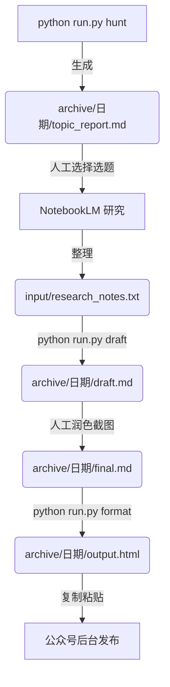

# 🚀 王往AI 公众号工作流

一套完整的 AI 驱动的微信公众号内容生产工作流，从选题到发布全流程自动化。

## ✨ 功能特性

| 模块 | 功能 | 技术栈 |
|------|------|--------|
| 🎯 **选题雷达** | 全网扫描热点，动态提取关键词，智能推荐选题 | DeepSeek + DuckDuckGo |
| ✍️ **写作智能体** | 读取研究笔记，生成符合人设的初稿 | DeepSeek Reasoner |
| 🎨 **排版智能体** | Markdown 转 HTML，极客代码风，一键复制 | Pygments + Premailer |

## 📁 项目结构

```text
wx_articles/
├── README.md                # 项目说明
├── requirements.txt         # Python 依赖
├── config.py               # 统一配置（API Key、路径、日期管理）
├── run.py                  # 统一入口脚本
├── agents/                 # 智能体模块
│   ├── __init__.py
│   ├── trend_hunter.py     # 🎯 选题雷达
│   ├── drafter.py          # ✍️ 写作智能体
│   └── formatter.py        # 🎨 排版智能体
└── data/                   # 数据目录
    ├── input/              # 当前工作笔记
    │   └── research_notes.txt
    └── archive/            # 按日期归档
        ├── 2025-12-02/     # 每次创作独立目录
        │   ├── topic_report_1230.md
        │   ├── research_notes.txt  # 笔记备份
        │   ├── draft.md
        │   ├── final.md
        │   └── output.html
        └── 2025-12-04/
            └── ...
```

## 🛠️ 安装

### 1. 克隆项目

```bash
cd D:\AIlearn
git clone <repo_url> wx_articles
cd wx_articles
```

### 2. 安装依赖

```bash
# 如果有代理
pip install -r requirements.txt --proxy http://127.0.0.1:7898

# 无代理
pip install -r requirements.txt
```

### 3. 配置 API Key

编辑 `config.py`，填入你的 DeepSeek API Key：

```python
DEEPSEEK_API_KEY = "sk-your-api-key-here"
```

或设置环境变量：

```bash
set DEEPSEEK_API_KEY=sk-your-api-key-here
```

## 🚀 使用方法

### 快速开始

```bash
# 查看帮助
python run.py help

# 运行选题雷达
python run.py hunt

# 运行写作智能体
python run.py draft

# 运行排版智能体
python run.py format

# 运行完整流程（交互式）
python run.py all
```

### 完整工作流



#### Step 1: 选题 🎯

```bash
python run.py hunt
```

- 自动扫描 GitHub Trending、ReadHub、小红书、微博、少数派
- AI 动态提取今日热词
- 推荐 3 个最适合你人设的选题
- 输出：`data/archive/2025-12-02/topic_report_1230.md`

#### Step 2: 研究 📚

1. 选择一个选题
2. 去 [NotebookLM](https://notebooklm.google.com/) 做深度研究
3. 整理笔记到 `data/input/research_notes.txt`

#### Step 3: 写初稿 ✍️

```bash
python run.py draft
```

- 读取研究笔记（自动备份到今日目录）
- DeepSeek Reasoner 生成初稿（流式输出）
- 输出：`data/archive/2025-12-02/draft.md`

#### Step 4: 润色 ✨

1. 打开今日目录下的 `draft.md`
2. 替换 `(TODO: ...)` 为实际截图
3. 润色文字，加入个人风格
4. 保存为同目录下的 `final.md`

#### Step 5: 排版发布 🎨

```bash
python run.py format
```

- 转换为微信公众号兼容的 HTML
- 极客代码风（VS Code 深色主题）
- 自动复制到剪贴板
- 输出：`data/archive/2025-12-02/output.html`
- 去公众号后台粘贴发布！

### 📅 日期归档说明

每次运行脚本，文件会自动保存到 `data/archive/YYYY-MM-DD/` 目录下。

这样设计的好处：

- **历史可追溯**：每次创作的素材、初稿、定稿都有完整记录
- **不会覆盖**：两三天更新一次，文件不会互相覆盖
- **便于回顾**：随时查看过去写了什么

## 🎨 排版风格

| 元素 | 样式 |
|------|------|
| 代码块 | VS Code 深色主题，圆角阴影 |
| H2 标题 | 居中，橙色下划线装饰 |
| 强调文字 | 加粗 + 醒目红色 |
| 引用块 | 谷歌蓝左边框 |
| 有序列表 | 橙色加粗数字 |

## ⚙️ 配置说明

编辑 `config.py` 自定义：

```python
# API 配置
DEEPSEEK_API_KEY = "your-key"

# 代理（无需代理设为 None）
PROXY_URL = "http://127.0.0.1:7898"

# 人设标签（用于选题过滤）
PERSONA_TAGS = ["AI", "DeepSeek", "效率", "工具", ...]
```

## 📦 依赖

- Python 3.9+
- openai
- httpx
- duckduckgo-search
- beautifulsoup4
- markdown-it-py
- pygments
- premailer
- pyperclip

## 🤝 作者

**王往AI** - 前搜广推算法工程师，专注 AI 工作流的硬核博主

---

*用 AI 帮你偷懒，把省下的时间用来生活。*
